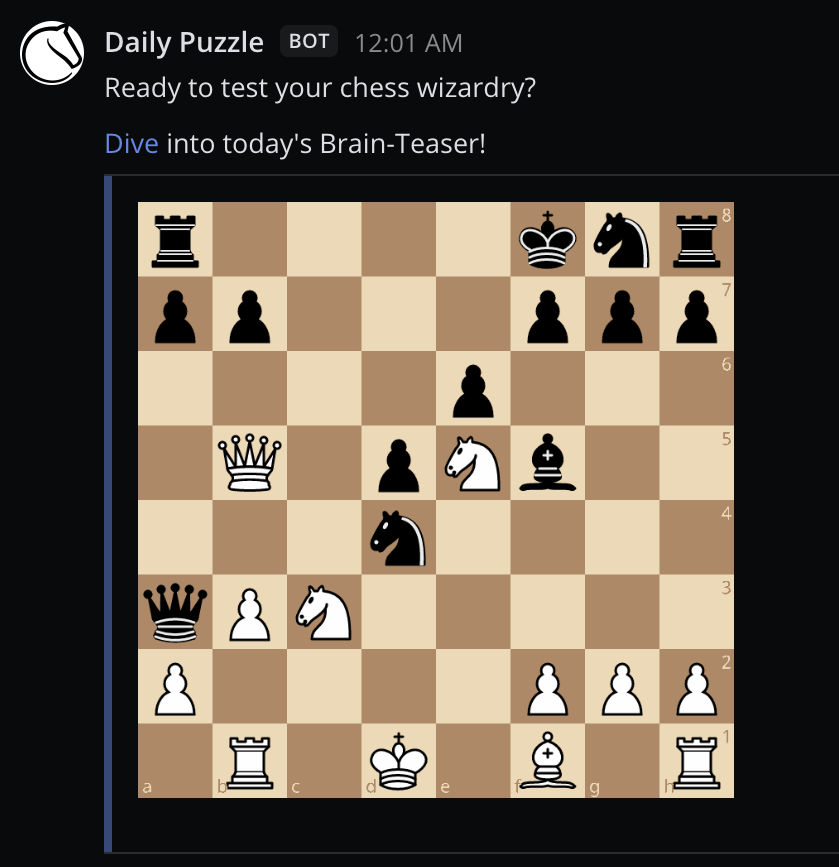
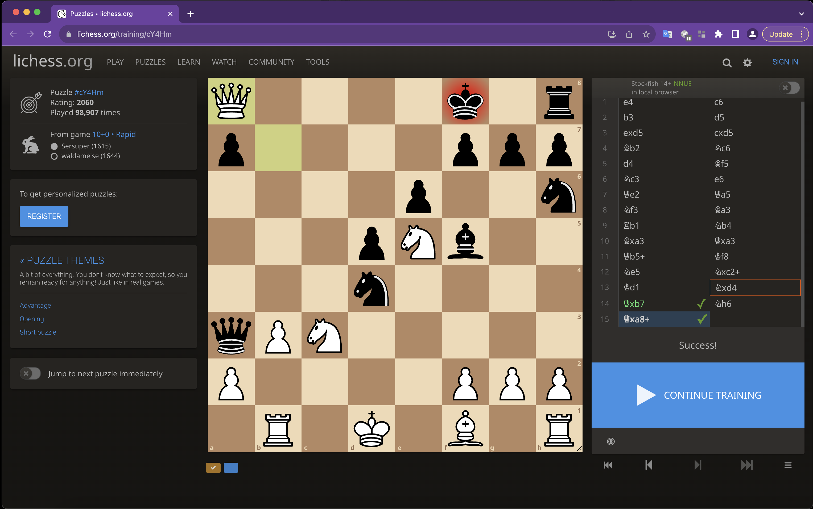
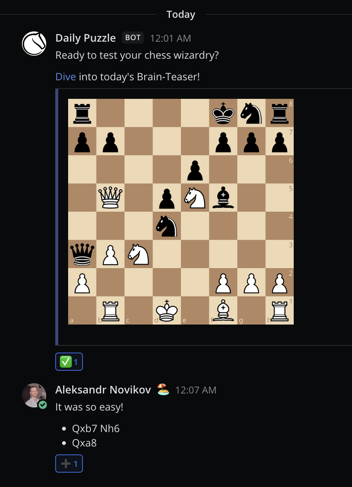
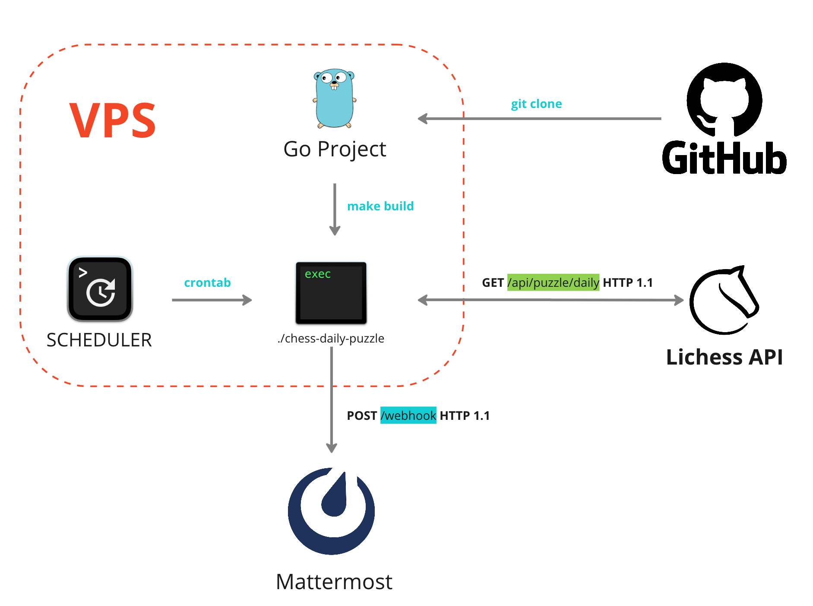

# Chess Daily Puzzle App

## Overview

Welcome to the Chess Daily Puzzle App, a Go-powered application designed to bring the excitement of daily chess puzzles from [Lichess](https://lichess.org/) directly to your Mattermost channels. If you're passionate about chess or simply want to challenge your team or community with daily brain teasers, this app is for you.



**Key Features:**
- **Stay Engaged:** Solve a new chess puzzle every day to keep your mind sharp.
- **Team Building:** Share chess puzzles with your team, fostering friendly competition and stimulating problem-solving discussions.
- **Continuous Learning:** Enhance your chess skills by practicing puzzles consistently.

## Visualize the Chess Board and Make Your Moves



## React with Emojis and Engage in Puzzle Discussions



## Architecture



## Before You Begin

### Mattermost Webhook URL

Before diving into the chess challenges, ensure you have your Mattermost Webhook URL ready. If you haven't set up an incoming webhook yet, follow these simple steps:

1. Create an incoming webhook. You can find step-by-step instructions [here](https://developers.mattermost.com/integrate/webhooks/incoming/).
2. Once created, copy the generated webhook URL.

### App Configuration

Now, let's configure the app to connect with your Mattermost channel:

1. Begin by cloning this repository to your local machine.
2. Locate the `.env.example` file in the project's root directory and rename it to `.env`.
3. Open the `.env` file and replace the `MATTERMOST_WEBHOOK_URL` value (`your_webhook_url_here`) with the actual Mattermost webhook URL you copied earlier.

### Customize Your App Presentation

The app's appearance can be customized according to your preferences. In the `internal/usecases/presentation/config.go` file, you can configure:

- **Username:** Choose a username that will be displayed when the app sends messages.
- **Message:** Define the message template as you see fit.
- **IconURL:** Set the URL for the app's icon or avatar.

Modify these values to personalize the way the app appears when delivering puzzles to your Mattermost channel.

## How to Run

Getting started is straightforward:

1. Build the application:

   ```bash
   make build
   ```

2. Set up a schedule:

   ```bash
   make schedule
   ```
   
The App fetches a daily chess puzzle and sends it to the configured Mattermost channel using the provided webhook URL at 11:11 AM on Monday, Wednesday and Friday.

However, you could configure any kind of schedule allowed by the [crontab](https://man7.org/linux/man-pages/man5/crontab.5.html).

## How to Debug

0. Set up your debug URL:

   ```bash
   MATTERMOST_WEBHOOK_URL_DEBUG = "your_webhook_url_here_for_debug"
   ```

1. Build the application:

   ```bash
   make build-debug
   ```

2. Run the application:

   ```bash
   ./chess-daily-puzzle-debug
   ```
   
Enjoy the daily chess challenges and let the strategic thinking begin!